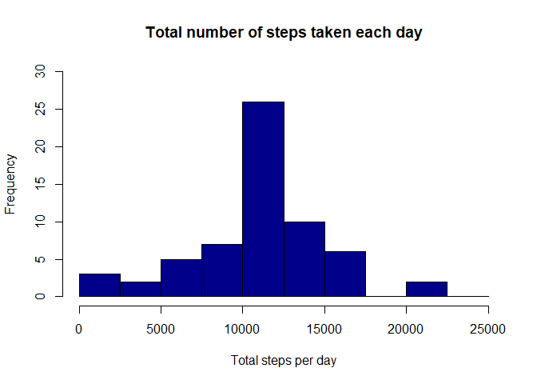
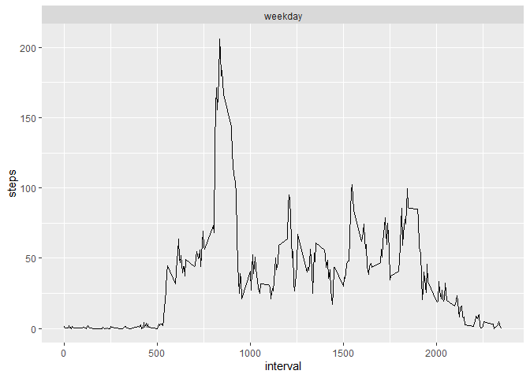

## Loading and preprocessing the data


```r
library(ggplot2)

activity <- read.csv("data/activity.csv")
activity$date <- as.POSIXct(activity$date, "%Y-%m-%d")
```

```
## Warning in strptime(xx, f, tz = tz): unknown timezone '%Y-%m-%d'
```

```
## Warning in as.POSIXct.POSIXlt(x): unknown timezone '%Y-%m-%d'
```

```
## Warning in strptime(xx, f, tz = tz): unknown timezone '%Y-%m-%d'
```

```
## Warning in as.POSIXct.POSIXlt(x): unknown timezone '%Y-%m-%d'
```

```
## Warning in strptime(xx, f, tz = tz): unknown timezone '%Y-%m-%d'
```

```
## Warning in as.POSIXct.POSIXlt(x): unknown timezone '%Y-%m-%d'
```

```
## Warning in strptime(xx, f, tz = tz): unknown timezone '%Y-%m-%d'
```

```
## Warning in as.POSIXct.POSIXlt(x): unknown timezone '%Y-%m-%d'
```

```
## Warning in strptime(xx, f, tz = tz): unknown timezone '%Y-%m-%d'
```

```
## Warning in as.POSIXct.POSIXlt(x): unknown timezone '%Y-%m-%d'
```

```
## Warning in strptime(x, f, tz = tz): unknown timezone '%Y-%m-%d'
```

```
## Warning in as.POSIXct.POSIXlt(as.POSIXlt(x, tz, ...), tz, ...): unknown timezone
## '%Y-%m-%d'
```

```r
weekday <- weekdays(activity$date)
```

```
## Warning in as.POSIXlt.POSIXct(x, tz): unknown timezone '%Y-%m-%d'
```

```r
activity <- cbind(activity,weekday)
summary(activity)
```

```
## Warning in as.POSIXlt.POSIXct(x, tz): unknown timezone '%Y-%m-%d'
```

```
##      steps             date               interval        weekday         
##  Min.   :  0.00   Min.   :2012-10-01   Min.   :   0.0   Length:17568      
##  1st Qu.:  0.00   1st Qu.:2012-10-16   1st Qu.: 588.8   Class :character  
##  Median :  0.00   Median :2012-10-31   Median :1177.5   Mode  :character  
##  Mean   : 37.38   Mean   :2012-10-31   Mean   :1177.5                     
##  3rd Qu.: 12.00   3rd Qu.:2012-11-15   3rd Qu.:1766.2                     
##  Max.   :806.00   Max.   :2012-11-30   Max.   :2355.0                     
##  NA's   :2304
```

## What is mean total number of steps taken per day?


```r
activity_total_steps <- with(activity, aggregate(steps, by = list(date), FUN = sum, na.rm = TRUE))
```

```
## Warning in as.POSIXlt.POSIXct(x, tz): unknown timezone '%Y-%m-%d'

## Warning in as.POSIXlt.POSIXct(x, tz): unknown timezone '%Y-%m-%d'
```

```r
names(activity_total_steps) <- c("date", "steps")
hist(activity_total_steps$steps, main = "Total number of steps taken per day", xlab = "Total steps taken per day", col = "darkblue", ylim = c(0,20), breaks = seq(0,25000, by=2500))
```

<!-- -->

Here is the mean of the total number of steps taken per day:


```r
mean(activity_total_steps$steps)
```

```
## [1] 9354.23
```

Here is the median of the total number of steps taken per day:


```r
median(activity_total_steps$steps)
```

```
## [1] 10395
```


## What is the average daily activity pattern?

1. Make a time series plot (i.e. `type = "l"`) of the 5-minute interval (x-axis) and the average number of steps taken, averaged across all days (y-axis)


```r
average_daily_activity <- aggregate(activity$steps, by=list(activity$interval), FUN=mean, na.rm=TRUE)
names(average_daily_activity) <- c("interval", "mean")
plot(average_daily_activity$interval, average_daily_activity$mean, type = "l", col="darkblue", lwd = 2, xlab="Interval", ylab="Average number of steps", main="Average number of steps per intervals")
```

<!-- -->
2. Which 5-minute interval, on average across all the days in the dataset, contains the maximum number of steps?


```r
average_daily_activity[which.max(average_daily_activity$mean), ]$interval
```

```
## [1] 835
```


## Imputing missing values


Note that there are a number of days/intervals where there are missing values (coded as NA). The presence of missing days may introduce bias into some calculations or summaries of the data.

1. Calculate and report the total number of missing values in the dataset (i.e. the total number of rows with NAs)


```r
sum(is.na(activity$steps))
```

```
## [1] 2304
```

2. Devise a strategy for filling in all of the missing values in the dataset. The strategy does not need to be sophisticated. For example, you could use the mean/median for that day, or the mean for that 5-minute interval, etc.


```r
imputed_steps <- average_daily_activity$mean[match(activity$interval, average_daily_activity$interval)]
```

3. Create a new dataset that is equal to the original dataset but with the missing data filled in.


```r
activity_imputed <- transform(activity, steps = ifelse(is.na(activity$steps), yes = imputed_steps, no = activity$steps))
total_steps_imputed <- aggregate(steps ~ date, activity_imputed, sum)
```

```
## Warning in as.POSIXlt.POSIXct(x, tz): unknown timezone '%Y-%m-%d'

## Warning in as.POSIXlt.POSIXct(x, tz): unknown timezone '%Y-%m-%d'
```

```r
names(total_steps_imputed) <- c("date", "daily_steps")
```

4. Make a histogram of the total number of steps taken each day and Calculate and report the mean and median total number of steps taken per day. Do these values differ from the estimates from the first part of the assignment? What is the impact of imputing missing data on the estimates of the total daily number of steps?


```r
hist(total_steps_imputed$daily_steps, col = "darkblue", xlab = "Total steps per day", ylim = c(0,30), main = "Total number of steps taken each day", breaks = seq(0,25000,by=2500))
```

<!-- -->

Here is the mean of the total number of steps taken per day:


```r
mean(total_steps_imputed$daily_steps)
```

```
## [1] 10766.19
```

Here is the median of the total number of steps taken per day:


```r
median(total_steps_imputed$daily_steps)
```

```
## [1] 10766.19
```

## Are there differences in activity patterns between weekdays and weekends?

Create a new factor variable in the dataset with two levels – “weekday” and “weekend” indicating whether a given date is a weekday or weekend day.
1. Convert date into weekdays
2. Now categorized days into weekend and weekdays
3. Take mean steps taken on weekend or weekday in the intervals
4. Create panel plot between average steps and interval separated by day type


```r
activity_imputed$days=tolower(weekdays(activity_imputed$date))
```

```
## Warning in as.POSIXlt.POSIXct(x, tz): unknown timezone '%Y-%m-%d'
```

```r
activity_imputed$day_type<-ifelse(activity_imputed$days=="sábado"|activity_imputed$days=="domingo","weekend","weekday")
avg_steps<-aggregate(activity_imputed$steps,by=list(activity_imputed$interval,activity_imputed$day_type),FUN=mean,na.rm=TRUE)
colnames(avg_steps)<-c("interval","day_type","steps")
```

Make a panel plot containing a time series plot (i.e. type = “l”) of the 5-minute interval (x-axis) and the average number of steps taken, averaged across all weekday days or weekend days (y-axis). See the README file in the GitHub repository to see an example of what this plot should look like using simulated data.


```r
ggplot(aes(x=interval,y=steps),data=avg_steps)+geom_line()+facet_wrap(~avg_steps$day_type)
```

<!-- -->
